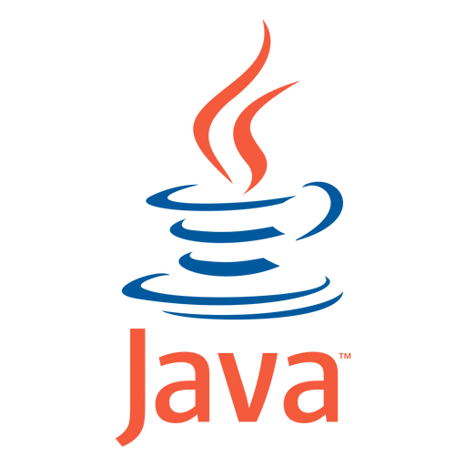

# Aprendendo Java ☕

### Versão Do java
java -version
java version "21.0.9" 2025-10-21 LTS
Java(TM) SE Runtime Environment (build 21.0.9+7-LTS-338)
Java HotSpot(TM) 64-Bit Server VM (build 21.0.9+7-LTS-338, mixed mode, sharing)

Olá! Meu nome é Kauan Felipe.

Sou uma pessoa com deficiência auditiva e me comunico em Libras e Português.

Sempre que vou postar algo, gosto de deixar uma mensagem carinhosa:

*I Love the World of Programming* ❤️ 

Este repositório foi criado para registrar minha jornada de aprendizado em Java e programação.

Atualmente sou estudante de Sistemas de Informação. Durante o curso tive meu primeiro contato com programação utilizando a linguagem C++ e ouvi que estudaremos Java na disciplina de Programação Orientada a Objetos (POO).

Por isso, decidi começar a estudar Java por conta própria para fortalecer minha base e chegar mais preparado às próximas disciplinas. Neste repositório estou registrando exercícios e pequenos projetos desenvolvidos enquanto aprendo os fundamentos da programação e pratico lógica de programação.

## O que estou estudando atualmente

- Entrada e saída de dados

- Variáveis

- Tipos de dados

- Operadores aritméticos

- Operadores lógicos

- Lógica de programação

## Futuramente pretendo estuda 

- Estrutura de Dados

- Banco de Dados (SQL)

- Spring Boot

- APIs

## programação para Web (Basíco)

- JavaScript

- HTML

- CSS

## Projetos

### Cálculo de Média

Projetos simples desenvolvido para praticar:
- Entrada de dados com Scanner
- Variaveis
- Operações matemáticas
- Exibição de resultado no console
- 
### Folha de pagamento simples
Projeto desenvolvido para praticar:

- Quantidade de horas trabalhadas
- Cálculo do valor a receber
- Entrada e saída de dados
- Operações matemáticas

## Objetivo

Meu objetivo é construir uma base sólida em programação antes de avançar para temas como:

- Estruturas condicionais

- Estruturas de repetição

- Métodos

- Programação Orientada a Objetos (POO)

- Estrutura de Dados

- Banco de Dados (SQL)

## Tecnologias

- Java

- Git

- GitHub

## Autor

Kauan Felipe

Estudante de Sistemas de Informação.
